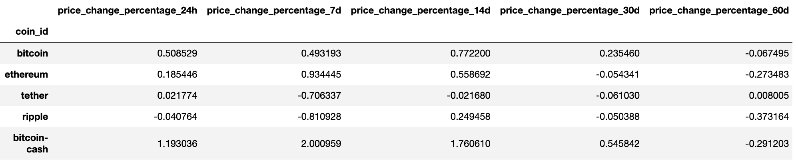

# CryptoClustering

## Instructions
1. Rename the Crypto_Clustering_starter_code.ipynb file as Crypto_Clustering.ipynb.
2. Load the crypto_market_data.csv into a DataFrame.
3. Get the summary statistics and plot the data to see what the data looks like before proceeding.

## Prepare the Data
- Use the StandardScaler() module from scikit-learn to normalize the data from the CSV file.
- Create a DataFrame with the scaled data and set the "coin_id" index from the original DataFrame as the index for the new DataFrame.
     - The first five rows of the scaled DataFrame should appear as follows:

